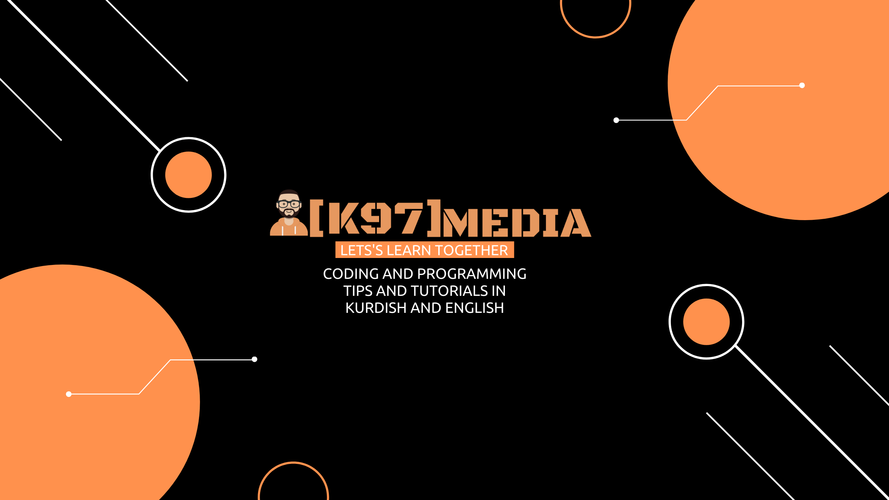

# K97 Media

K97 Media is a [Youtube channel](https://www.youtube.com/channel/UC9j6pieJxlXmpq0k7kV1VDg) focused on Programming and Coding Tutorials and Tips.

The tutorials are in **Kurdish** and **English** language.

-----------------------------------------------------

Here all the Codes for the tutorials can be found.

Note:
Every Tutorial on the Youtube Channel will have a specific Repository here. Which will be devided on different branches .

Main(Master) will have a readme file about the tutorial.
All other lessons will have their own branch with the same name as the lesson on Youtube Channel.
There is a **Repository** named Cheat Sheet. This repository will have Cheat Sheets written in Markdown. Mainly the Cheat Sheets will be added randomly and not based on Tutorials.

----------------------------------------

Get in Touch :

 
 
